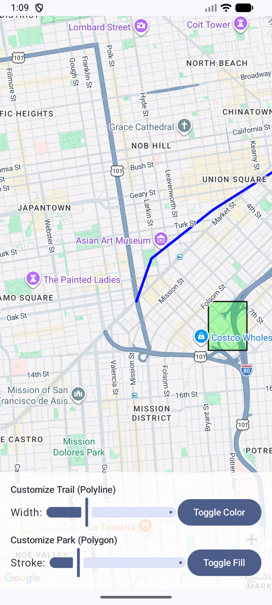

# AshishAssignment4_Q3

# Polyline and Polygon Map App (Android - Jetpack Compose)

This Android app uses **Google Maps** to display a hiking trail using a **polyline** and a park area using a **polygon**.

The app also allows the user to customize the appearance of both overlays by changing their **color** and **width**.  
When the user taps on the trail or park area, the app shows information using a toast message.

---

## Features

- Displays a **Google Map**
- Shows a **polyline** representing a hiking trail
- Shows a **polygon** representing a park / area of interest
- Lets the user customize:
  - Polyline color
  - Polyline width
  - Polygon fill color
  - Polygon stroke width
- Detects clicks on overlays
- Displays information when the user taps the polyline or polygon

---

## Screenshot

---

## Technologies Used

- **Kotlin**
- **Jetpack Compose**
- **Google Maps Compose**
- **Polyline**
- **Polygon**
- **Material 3**

---

## Main Files

- `MainActivity.kt` → Google Map, polyline, polygon, customization controls, and click listeners
- `AndroidManifest.xml` → app configuration, permissions, and Google Maps API setup

---

## How It Works

- The app opens a Google Map centered near the trail coordinates
- A **polyline** is drawn to represent a hiking trail
- A **polygon** is drawn to highlight a park area
- Sliders are used to change the width of the polyline and polygon stroke
- Buttons are used to toggle the colors
- When the user taps on the trail or park overlay, a toast message shows information about that overlay

---

## How to Run

1. Open the project in **Android Studio**
2. Add your **Google Maps API key**
3. Run the app on an emulator or Android device
4. Use the controls at the bottom to customize the overlays
5. Tap on the trail or polygon area to see overlay information

---

## Notes

- Internet is required to load Google Maps
- A valid Google Maps API key is required
- The trail and park coordinates are hardcoded for demonstration

---

## AI Usage

I used AI tools (ChatGPT) to help fix some issues related to:
- XML configuration errors
- Google Maps API key setup
- General debugging and small fixes
- README formatting

The main app logic, implementation, and design are my own work.

---

##  Author

Ashish Joshi  
Boston University
